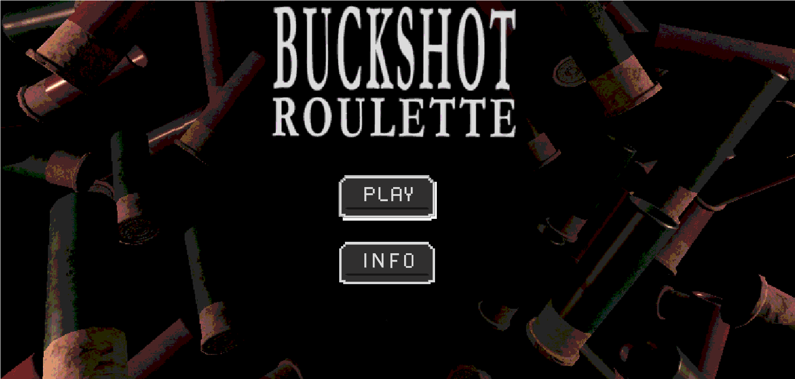
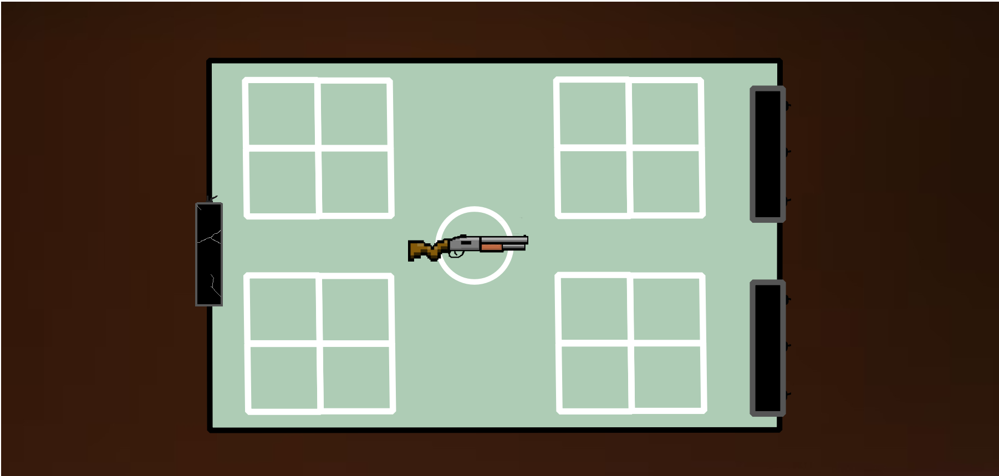
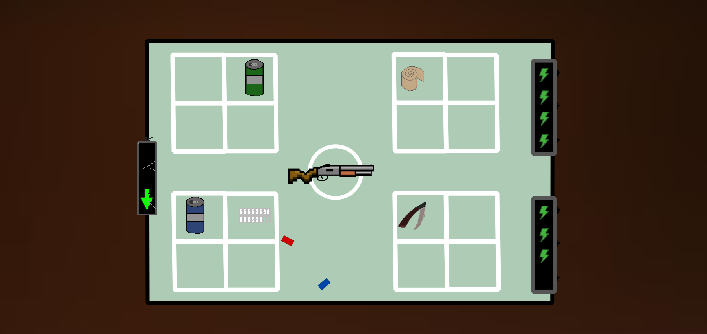

# buckshotBuckshot Roulette 

#Equipo de desarrollo

-   Gaston Alvarez 
-   Guido Benenati

Menu:
interfaz :
Gameplay:

## Reglas de Juego / Instrucciones
Introduccion:
Este trabajo intenta recrear un juego llamado Buckshot Roulette q es una versión extendida del juego de la ruleta rusa .En este dos jugadores (Uno que nosotros controlaremos y la máquina) se enfrentarán en una mesa con una escopeta que al inicio de cada ronda se cargará con un número aleatorio de balas visibles (balas de fogueo y balas reales) así revelando la cantidad y el tipo por única vez en la ronda .El objetivo es acabar con el adversario antes de que este lo haga con nosotros para esto disponemos de una cantidad de diversos objetos que serán entregados aleatoriamente a cada participante ,Cada uno con un efecto diferente que altera el desarrollo de la partida ,También contamos con una cierta cantidad de cargas de vida que no debe llegar a cero .El juego no cuenta con un tiempo fijo por ronda ya que el desarrollo de la partida irá cambiando .A lo largo de la partida debemos jugar con la información de las balas que se nos permitirá predecir los movimientos de nuestro adversario 

Reglas del Juego :

Escopeta:
Al inicio de cada ronda la escopeta se cargará con un número aleatorio de BALAS entre dos Tipos(Reales,Fogueo)
Siempre tendrá como mínimo un tipo de cada bala.
Mientras tenga balas siempre habrá una en la recámara que es la que se está por utilizar

Balas:

    Reales:Estas balas cuando se disparan causan daño //Color Rojo
    Fogueo:Estas balas cuando se disparan No causan daño //Color Azul

Las balas tienen un orden predefinido al inicio de cada ronda que se respeta durante toda esta .Por lo cual podremos contar las balas que quedan y en qué posición 

Turnos:
Los turnos son alternados y cambian cuando un oponente recibe un disparo (real o falso)
//Leer -Aclaración escenarios -Dinámica de turnos
Por cada turno el jugador puede usar cuantos consumibles/objetos quiera .Estos alteran el desarrollo de la partida, las balas y los turnos
En un turno cada jugador puede optar por dos opciones 
    Disparce a si mismo 
    Disparar al oponente

    -Aclaración escenarios -Dinámica de turnos :
        -Disparar al oponente     -Bala Verdadera  --->Cambio de turno
        -Disparar al oponente     -Bala Falsa      --->Cambio de turno
        -Dispararse a si mismo    -Bala Verdadera  --->Cambio de turno
        -Dispararse a si mismo    -Bala Falsa      --->No cambia el turno

Rondas:
Al inicio de cada ronda se carga  la ESCOPETA dejando ver por única vez las cantidad de balas y el tipo de cada una  ,además se entregan a cada JUGADOR por única vez la misma cantidad de objetos (La cantidad es aleatoria) los OBJETOS que le tocaba a cada uno son aleatorios y se pueden repetir 
En una partida las rondas se jugarán hasta que un jugador pierda todas sus vidas.
El turno al iniciar la partida en la primera ronda es aleatorio ,Luego al iniciar otras rondas sigue jugando el jugador que tenga el turno 

Consumibles / Objetos :

Al iniciar la partida se entregará por única vez una cantidad de objetos igual a cada jugador.
Estos objetos pueden ser usados por el jugador en su turno antes de disparar y alterar diversos factores en la partida dependiendo de cada uno 
Se cuenta con 8 slots para colocar los objetos ,cuando esten llenos no se permitirán sacar mas objetos por lo cual nunca superara el numero maximo 
Cada vez que se usa un objeto este se gasta y se descarta ,dejando asi un lugar libre para otro objeto 

Bebidas:

Cerveza:Al utilizarse esta permite sacar la bala que se encuentra en la recamara mostrándola en el proceso 

Cerveza Light:Esta actúa igual q la cerveza común pero inhabilita que puedas usar objetos de tipo curación durante un turno 
Cerveza Vencida : Esta actúa igual que la cerveza común pero tiene una probabilidad de quitarte vida 
Soda:Al utilizarse esta permite sacar las dos próximas balas y mostrarlas

Curaciones:(Todas las curaciones de esta lista inhabilitan las curaciones durante un turno)

Puchos:Al utilizarse esta otorga una vida mas al jugador 
Abanos:Al utilizarse espe puede curar 1 o 2 vidas dependiendo de la suerte 
Abanos:Al utilizarse espe puede curar 1 vida a cambio de perder el turno 
Píldoras:Al utilizarse espe puede curar 2 vidas o quitarte 1 vida dependiendo de la suerte 

Serruchos

Serrucho:Al utilizarse esta duplica el daño de la escopeta 
Serrucho Oxidado:Al utilizarse esta duplica el daño de la escopeta y puede inhabilitar el siguiente disparo dependiendo del azar 

Informacion:

Lupa:Al utilizarse brinda información de la bala en la recamara 

Teléfono:Al utilizarse y siempre en cuando queden mas de 2 balas este rebela la posición y el tipo de una bala aleatoriamente  

Comodin:

Inversor:Al utilizarse este cambial alterna el tipo de la bala en la recámara sin revelar información sobre esta 

Adrenalina:Al utilizarse esta permite escoger un objeto para robar de la lista de objetos del adversario 

Esposas:Al utilizarse estas esposan al adversario haciéndole perder el siguiente turno 

Dificultades:
La dificultad varía en 2 niveles (Facil,Dificil)

Fácil:La vida del jugador supera en 2 puntos a la del adversario mientras que los objetos están restringidos a 8 
Difícil:Las vidas al comienzo de cada partida son iguales para ambos jugadores y la lista de objetos es de 15 en total 
